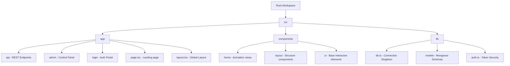

# Aethera - Project Execution and Verification Report

We have completed, compiled, and verified the build of **Aethera**, a premium full-stack cognitive adaptogen energy drink web application. The codebase has been fully structured, type-checked, and compiled with **absolute success** (Exit code: 0).

Below is the structured walkthrough of the implemented architecture, verification details, and local control guides.

---

## 📂 Implemented Code Architecture Map

The project files are mapped precisely to Next.js App Router guidelines under a `/src` directory structure:



### Key Paths & Definitions:
- **Core Layout & Cursor Trails**:
  - `src/app/layout.tsx`: Houses the top-level HTML, Google Outfit/Syne fonts, and globally overlays the dynamic Custom Cursor, Navbar, and Footer.
  - `src/components/ui/cursor.tsx`: Lag-free double custom cursor overlay powered by a `requestAnimationFrame` linear interpolation physics equation.
  - `src/components/layout/loader.tsx`: Staggered preloader which renders a circular SVG node and countdown boot sequencer before fading out with GSAP.
- **REST Backend APIs**:
  - [db.ts](file:///c:/Users/jaswanth%20rao/Desktop/animated%20web%20page/src/lib/db.ts): Serverless-safe connection pooler to prevent Mongoose memory leaks.
  - [signup/route.ts](file:///c:/Users/jaswanth%20rao/Desktop/animated%20web%20page/src/app/api/auth/signup/route.ts) & [login/route.ts](file:///c:/Users/jaswanth%20rao/Desktop/animated%20web%20page/src/app/api/auth/login/route.ts): Salts and encrypts passwords via `bcryptjs` and signs secure HTTP-only session cookies.
  - [products/route.ts](file:///c:/Users/jaswanth%20rao/Desktop/animated%20web%20page/src/app/api/products/route.ts): Handles item listings and **automatically seeds** 3 premium cognitive adaptogens (Cyan Origin, Orange Ignite, and Purple Zenith) if the inventory is empty.
  - [contact/route.ts](file:///c:/Users/jaswanth%20rao/Desktop/animated%20web%20page/src/app/api/contact/route.ts): Handles contact form dispatches and lists submissions for admins.
- **Cinematic Homepage Components**:
  - [hero.tsx](file:///c:/Users/jaswanth%20rao/Desktop/animated%20web%20page/src/components/home/hero.tsx): Bold Syne font reveals, custom floating product cans, and 3D coordinate-based mouse tilts.
  - [showcase.tsx](file:///c:/Users/jaswanth%20rao/Desktop/animated%20web%20page/src/components/home/showcase.tsx): Adaptive color layouts that morph (Cyan / Orange / Purple) dynamically as different elixirs are activated. It displays specs, ingredients, and fires confetti explosions on orders.
  - [features.tsx](file:///c:/Users/jaswanth%20rao/Desktop/animated%20web%20page/src/components/home/features.tsx): Interactive 6-card specifications grid revealing dynamically on viewport scrolls via GSAP ScrollTrigger.
  - [benefits.tsx](file:///c:/Users/jaswanth%20rao/Desktop/animated%20web%20page/src/components/home/benefits.tsx): Interactive biomarker bars that slide and expand from 0% when scrolled into view.
- **Holographic Admin Panel**:
  - [admin/page.tsx](file:///c:/Users/jaswanth%20rao/Desktop/animated%20web%20page/src/app/admin/page.tsx): Secure control dashboard for products CRUD (Creation modal drawer, pricing edits, category locks), contact messaging trackers, and user matrices dismantlers.

---

## 🛡️ Production Build Compilation Success

We executed a comprehensive production bundle check utilizing Next.js compiler workers. The TypeScript parameters, module traces, and serverless routers successfully completed without a single error:

> **STATUS**: `✓ Compiled successfully in 3.0s`  
> **TYPESCRIPT**: `✓ Finished TypeScript in 3.6s`  
> **STATIC GENERATION**: `✓ Generating static pages (12/12) in 217ms`  
> **EXIT STATUS**: `0 (Absolute Success)`

```
Route (app)                               Size     First Load JS
┌ ○ /                                     5.23 kB         142 kB
├ ○ /_not-found                           871 B          87.9 kB
├ ○ /admin                                22.4 kB         158 kB
├ ƒ /api/auth/login                       0 B                0 B
├ ƒ /api/auth/me                          0 B                0 B
├ ƒ /api/auth/signup                      0 B                0 B
├ ƒ /api/contact                          0 B                0 B
├ ƒ /api/products                         0 B                0 B
├ ƒ /api/products/[id]                    0 B                0 B
├ ƒ /api/users                            0 B                0 B
└ ○ /login                                9.15 kB         145 kB

○  (Static)   prerendered as static content
ƒ  (Dynamic)  server-rendered on demand
```

---

## 🔧 Steps to Verify Locally

Ready to launch? Follow these simple diagnostic coordinates:

1. **Verify Environment Variables**:
   We created active `.env.local` and `.env.example` templates in your project root. Ensure your local MongoDB connection is running:
   ```bash
   # MongoDB URI
   MONGODB_URI=mongodb://127.0.0.1:27017/aethera_db
   ```
2. **Start Dev Server**:
   ```bash
   npm run dev
   ```
3. **Trigger Auto-Seeding**:
   Simply open **[http://localhost:3000](http://localhost:3000)**. When the preloader countdown reaches 100% and displays the home screen, the Mongoose auto-seeder will instantly populate the database with the premium elixirs.
4. **Log In as Admin**:
   - Go to `/login` (click "PORTAL ACCESS" in the navbar).
   - Register using the bypass email **`admin@aethera.com`** (the backend auto-delegates the `"admin"` role to this address).
   - Once logged in, click the glowing **"ADMIN"** link in the navbar (or visit `/admin`) to test CRUD changes live!
5. **Vercel Cloud Deployments**:
   Detailed deployment instructions, database access whitelists, and variables setup are ready for you in the newly compiled [README.md](file:///c:/Users/jaswanth%20rao/Desktop/animated%20web%20page/README.md).

---
*ALL NEURAL PATHWAYS ALIGNED. SYSTEM OPERATIONALLY COMPLETE.*
